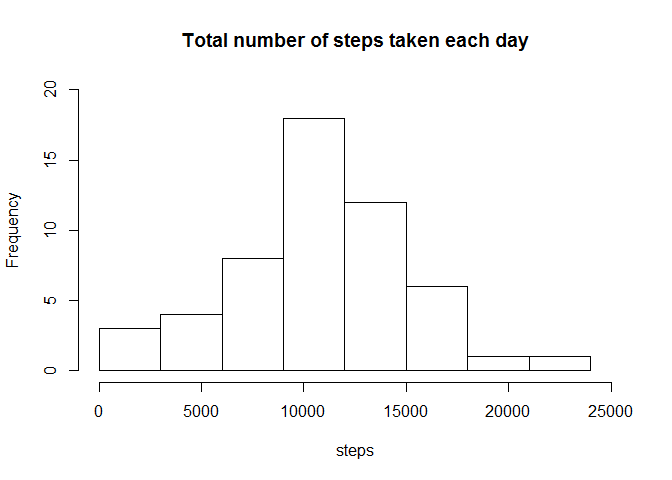

# Reproducible Research: Peer Assessment 1


## Loading and preprocessing the data
Read the activity file into a data frame Using read.csv, followed by removing NAs.


```r
## Read the csv file
dat1 <- read.csv("activity.csv")

## remove NAs
clean <- na.omit(dat1)

## Set R numbers to be rounded to 2 decimals
options(scipen = 1, digits = 2)
```

## What is mean total number of steps taken per day?

Get the total number of steps in each of the days

```r
## Aggregate the clean dataset using sum of steps by days
aggr <- aggregate(steps ~ date, clean, sum)
```

Plot the histogram for total number of steps taken per day

```r
## Plot the histogram of 'total steps taken per day'
with(aggr, hist(steps, breaks=seq(0,24000,3000), xlim=c(0,25000), ylim=c(0,20), main="Total number of steps taken each day"))
```

 

```r
## Report the mean and median rounded to an integer to make a whole step.
rep.mean <- round(mean(aggr$steps), 0)
rep.median <- median(aggr$steps)
```
### Answer  
The mean is **10766** steps and median is **10765** steps.

## What is the average daily activity pattern?

Find the average steps taken for all intervals across all days. 


```r
## Aggregate the clean dataset using mean of steps by intervals rounded to make a whole step
aggr <- aggregate(steps ~ interval, clean, function(x) round(mean(x),0))
```

Plot the time series line graph of interval against average steps

```r
## Plot the time series line graph of 'average steps taken per interval'
with(aggr, plot(interval, steps, type='l', main="Avg # of steps taken (avg across all days) Vs the 5-min intervals"))
```

 

```r
## Report which 5-minute interval on average across all days contains the maximum number of steps
max.steps <- with(aggr, aggr[steps==max(steps),])
```
### Answer  
ANS: The interval of **835** contains the max number of steps in average (**206** steps).

## Inputing missing values
### Strategy to fill in missing values
Using above daily average steps taken for each interval to replace the NAs in the original dataset.

Using the 'interval' column as index, duplicate the original dataset and merged with the data frame with daily average steps taken for each interval. 

Then create an additional column 'steps.y' containing the average values for each interval and the original column 'steps' is renamed as 'steps.x'.  
Copy column 'steps.y' to column 'steps.x' for only rows with NA.


```r
## Duplicate original dataset and merge with data frame (aggr) containing daily average steps taken for each interval
dat2 <- dat1
dat2 <- merge(dat2, aggr, "interval")

## Copies average values from column 'steps.y' to column 'steps.x' where the row is NA. Renames column 'steps.x' back to 'steps'
dat2$steps.x[is.na(dat2$steps.x)] <- dat2$steps.y[is.na(dat2$steps.x)]
colnames(dat2)[2] <- "steps"
```
Repeat the first part and get the histogram.

```r
## Aggregate the 'dat2' dataset using sum of steps by days
aggr2 <- aggregate(steps ~ date, dat2, sum)

## Plot the histogram of 'total steps taken per day'
with(aggr2, hist(steps, breaks=seq(0,24000,3000), xlim=c(0,25000), ylim=c(0,25), main="Total number of steps taken each day"))
```

 

```r
## Report the mean and median, rounded to an integer since we cannot have fraction of a step.
rep.mean2 <- round(mean(aggr2$steps), 0)
rep.median2 <- median(aggr2$steps)
```
### Answer  
ANS: The mean is **10766** steps and median is **10762** steps.  
Comparing the histogram, the frequency of mean value has increased however the mean value remains unchanged despite median value changed. 

(Previous: The mean is 10766 steps and median is 10765 steps.)


## Are there differences in activity patterns between weekdays and weekends?

1) Add a new column 'wday' that will contain the calendar day of each date.

2) Replace the calendar day with the correct indication of either weekday or weekend.

3) Subset into two data frames 't1' and 't2' containing rows with weekday and weekend

4) Perform aggregate on 't1' and 't2' by the average steps of each interval. 

5) Add the column 'wday' back into each data frame and combine both data frames as 'aggr6'.


```r
## Add 'wday' column containing the calendar day of each date
dat2$wday <- sapply(dat2$date, function(x) weekdays(strptime(x, "%Y-%m-%d")))

## Check and replace calendar day with either "weekday" or "weekend"
dat2$wday <- sapply(dat2$wday, function(x) { if(x=="Saturday"|x=="Sunday") x <- "weekend" else x <- "weekday" })

## Aggregate average steps of each interval on weekday rows
t1 <- subset(dat2, wday=="weekday")
aggr4 <- aggregate(steps ~ interval, t1, function(x) round(mean(x), 0))
aggr4$wday <- "weekday"

## Aggregate average steps of each interval on weekend rows
t2 <- subset(dat2, wday=="weekend")
aggr5 <- aggregate(steps ~ interval, t2, function(x) round(mean(x), 0))
aggr5$wday <- "weekend"

## Combine both data frames back into one
aggr6 <- rbind(aggr4, aggr5)
```
Plot the lattice graph of average steps taken every 5 minute interval across all weekdays and weekends.

```r
## Load the 'lattice' library and plot the graph by weekday and weekend
library(lattice)
aggr6 <- transform(aggr6, wday = factor(wday))
xyplot(steps ~ interval | wday, data=aggr6, type="l", layout=c(1,2))
```

 

### Answer  
ANS: No much difference is observed between average steps taken during weekdays and weekends. 

For weekdays, activity is observed at an earlier interval and lesser activities during working hours intervals. It is also observed that in both weekdays and weekends, more steps are taken during morning.
